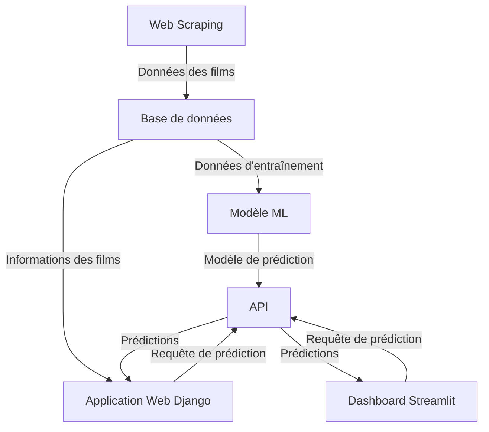
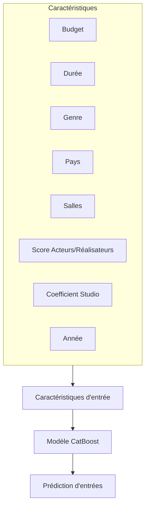

# CinApps

CinApps est une plateforme d'analyse cinématographique conçue pour prédire les performances au box-office des films. Ce projet combine le web scraping, l'apprentissage automatique et une interface web conviviale pour aider les exploitants de cinéma à prendre des décisions basées sur les données.


## 📋 Table des matières

- [Aperçu du projet](#aperçu-du-projet)
- [Architecture](#architecture)
- [Fonctionnalités](#fonctionnalités)
- [Technologies utilisées](#technologies-utilisées)
- [Installation](#installation)
- [Configuration](#configuration)
- [Utilisation](#utilisation)
- [Structure du projet](#structure-du-projet)
- [API](#api)
- [Modèle ML](#modèle-ml)
- [Contributeurs](#contributeurs)
- [Licence](#licence)

## 🔍 Aperçu du projet

CinApps est une solution complète qui permet aux exploitants de cinéma de prédire le succès potentiel des films à l'affiche. Le système collecte automatiquement des données sur les films à venir, utilise un modèle d'apprentissage automatique pour prédire les entrées en salle, et présente ces informations via une interface web intuitive.



## 🏗️ Architecture

Le projet est structuré en plusieurs composants clés:

1. **Web Scraping (automatisation)**: Collecte des données de films depuis Allocine
2. **Machine Learning (ML)**: Entraîne et évalue les modèles de prédiction
3. **Service API (API_s)**: Fournit des prédictions via un endpoint FastAPI
4. **Application Web (cinapps)**: Interface utilisateur basée sur Django
5. **Dashboard (streamlit)**: Visualisation alternative basée sur Streamlit

## ✨ Fonctionnalités

- **Collecte automatique de données**: Scraping des informations sur les films à venir
- **Prédiction du box-office**: Prédiction ML des performances des films
- **Classement des films**: Tri des films par performance prédite
- **Analyse financière**: Estimation des revenus et des bénéfices
- **Authentification utilisateur**: Accès sécurisé à la plateforme
- **Dashboard interactif**: Visualisation des prédictions et des données

## 🛠️ Technologies utilisées

| Composant | Technologies |
|-----------|-------------|
| Web Scraping | Scrapy, Python |
| Base de données | MySQL, SQLite |
| Machine Learning | scikit-learn, CatBoost, pandas |
| API | FastAPI |
| Application Web | Django, Bootstrap |
| Dashboard | Streamlit |
| Déploiement | Docker |

## 📥 Installation

1. **Cloner le dépôt**
   ```bash
   git clone https://github.com/votre-utilisateur/cinapps.git
   cd cinapps
   ```

2. **Installer les dépendances**
   ```bash
   pip install -r requirements.txt
   ```

3. **Configurer les variables d'environnement**
   Créez un fichier `.env` à la racine du projet avec les variables suivantes:
   ```
   SECRET_KEY=votre_clé_secrète
   DEBUG=1
   MYSQL_USER=utilisateur_mysql
   MYSQL_PASSWORD=mot_de_passe_mysql
   MYSQL_HOST=localhost
   MYSQL_PORT=3306
   MYSQL_DATABASE=cinapps
   MYSQL_RDY=1
   URL_API=http://localhost:8000/prediction/
   ```

## ⚙️ Configuration

### Base de données


1. Créez une base de données MySQL:
   `


-- Création de la table Films
CREATE TABLE Films (
    id_film INT AUTO_INCREMENT PRIMARY KEY,
    titre VARCHAR(255) NOT NULL,
    duree INT,
    salles INT,
    genre VARCHAR(255),
    date_sortie DATE,
    pays VARCHAR(255),
    studio VARCHAR(255),
    description TEXT,
    image VARCHAR(255),
    budget INT,
    entrees INT,
    film_url VARCHAR(255),
);

-- Création de la table Personnes (Acteurs et Réalisateurs)
CREATE TABLE Personnes (
    id_personne INT AUTO_INCREMENT PRIMARY KEY,
    nom VARCHAR(255) NOT NULL
);

-- Création de la table Participations (relations entre films et personnes)
CREATE TABLE Participations (
    id_film INT,
    id_personne INT,
    role ENUM('acteur', 'realisateur') NOT NULL,
    PRIMARY KEY (id_film, id_personne, role),
    FOREIGN KEY (id_film) REFERENCES Films(id_film) ON DELETE CASCADE,
    FOREIGN KEY (id_personne) REFERENCES Personnes(id_personne) ON DELETE CASCADE
);

2. Exécutez les migrations Django:
   ```bash
   cd cinapps
   python manage.py migrate
   ```

### Modèle ML

Le modèle ML est préentraîné et disponible dans le dossier `ML/model.pkl`. Pour réentraîner le modèle:

1. Exécutez le notebook Jupyter:
   ```bash
   cd ML
   jupyter notebook modelisation.ipynb
   ```

## 🚀 Utilisation

### Démarrer l'application Django

```bash
cd cinapps
python manage.py runserver
```
L'application sera accessible à l'adresse http://localhost:8000

### Démarrer l'API

```bash
cd API_s
uvicorn main:app --reload
```
L'API sera accessible à l'adresse http://localhost:8000/prediction/

### Démarrer le dashboard Streamlit

```bash
cd streamlit
streamlit run app.py
```
Le dashboard sera accessible à l'adresse http://localhost:8501

### Exécuter le scraper

```bash
cd automatisation
scrapy crawl alloc_newfilms -o data.json
```

## 📁 Structure du projet

```
cinapps_project/
├── API_s/                  # Service API FastAPI
│   ├── main.py             # Application FastAPI
│   ├── model_utils.py      # Utilitaires pour le modèle
│   └── model.pkl           # Modèle sérialisé
├── ML/                     # Composant Machine Learning
│   ├── modelisation.ipynb  # Notebook d'entraînement
│   └── model.pkl           # Modèle entraîné
├── automatisation/         # Composant de scraping
│   └── imdb/
│       └── spiders/        # Spiders Scrapy
├── cinapps/                # Application Django
│   ├── accounts/           # App d'authentification
│   ├── functionalities/    # App de fonctionnalités
│   ├── main/               # App principale
│   └── templates/          # Templates HTML
└── streamlit/              # Dashboard Streamlit
    └── app.py              # Application Streamlit
```

## 🔌 API

L'API expose un endpoint pour les prédictions:

- **POST** `/prediction/`: Accepte les caractéristiques d'un film et retourne une prédiction de box-office

Exemple de requête:
```json
{
  "budget": 25000000,
  "duree": 120,
  "genre": "Action",
  "pays": "France",
  "salles_premiere_semaine": 300,
  "scoring_acteurs_realisateurs": 5.2,
  "coeff_studio": 2,
  "year": 2023
}
```

Exemple de réponse:
```json
{
  "prediction": 150000
}
```

## 🧠 Modèle ML

Le modèle utilise les caractéristiques suivantes pour prédire les entrées au box-office:

- Budget du film
- Durée
- Genre
- Pays de production
- Nombre de salles
- Score des acteurs/réalisateurs
- Coefficient du studio
- Année de sortie



## 👥 Contributeurs

- [Deborah S.](https://github.com/Memory77)

## 📄 Licence

Ce projet est sous licence [MIT](LICENSE). 
